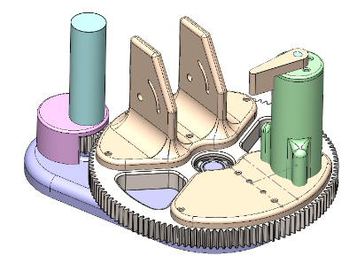
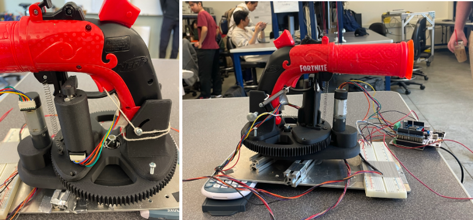

# ME 405 Term Project
For our ME 405 term project we have designed a tracking and triggering system for a Nerf gun that utilizes two servo motors and a thermal camera to hit a target. These components were controlled by a Nucleo STM32L476 microcontroller, and the software was coded in Python and micropython. This design was to be used for educational purposes by students of ME 405. The purpose of the Nerf gun system was to participate in a duel against similar systems designed by classmates. Two participants were to stand behind their Nerf gun, move around for five seconds, and freeze while the opponent's gun tried to shoot them. Our system was ultimately successful in aiming, triggering, and hitting our opponent.

## Hardware and Mechanical Design
The turret hardware consists of a Nucleo STM32L476RG, and an adapter board, the “Shoe of Brian” which adds additional features to the Nucleo necessary for our project. To allow controlled actuation and triggering of the turret we employed two servo motors lent to us by the ME 405 lab and a thermal camera to sense the thermal signature of our target and calculate the setpoint for our aiming motor.
The mechanical design consists of 3D-printed gears, bearings, a baseplate, motor mounts, and a fixture to house the Nerf gun. The CAD model of the system is shown below with details regarding each component of the system and their purpose.

**Figure 1:** Turret CAD Model

The gear ratio of our system is 6:1 and was designed to allow the turret to spin 180 degrees in one second. Overall, our design was made to be as simple and compact as possible while still being able to meet the requirements of the project.

**Figure 2:** Fully assembled turret with aiming and triggering subsystems.

To aid in providing the necessary force to engage the trigger mechanism, the team added a spring-tensioned string through the bottom portion of the trigger. Thus, when the servo moved the triggering lever, the trigger would engage consistently. A barrel support piece was added to aid in the gun's stability. Another spring was used to keep the gun secured on this support piece as seen in the left image above.

## Software Overview
The software for controlling the turret system was written in micropython such that it could be uploaded and run on the Nucleo. The team used a priority scheduler to efficiently run each task in the order of most time-sensitive to least time-sensitive. A generator function was used to generate effective multitasking between different system tasks.

## Results
Our design was successful in tracking a target and shooting them after 5 seconds of the duel being initiated. However, we only produced this result once during our duel. We ran into some issues with the hardware, such as the wiring getting caught in the gears during the duel. We also missed our target two times. We tested our system at multiple stages in the project. Before we tested our FSM on the fully built system, we used the motors with flywheel attachments in the lab to ensure we were getting the expected outcome. Once the two motors were properly operating, we built the whole system and tested the full operation. This stage of testing included tuning the values of Kp for both the panning motor and the trigger motor. We aimed to minimize overshoot for the panning motor and ensure a large enough PWM signal was being sent to the trigger motor. Additionally, we adjusted the calculation for getting the position of the target from the thermal camera's output and converting this to how many degrees to turn the panning motor. To do this, we had to take into account that the thermal camera was closer to the target than the gun, and thus had a different angular relationship to the target than the gun. Improvements that could be made to the system to yield a more consistent outcome will be discussed in the next section.

## Takeaways and Recommendations
Overall, this project was very informative in terms of how to effectively implement a FSM in Python while utilizing a priority scheduler. You have to make sure that the period of your tasks is less than the period specified in the scheduler to ensure the correct operation. Also, the priority of the tasks must be balanced such that each task will have the chance to run. Having too high of a priority for a task may result in that task being run exclusively. Also, the team learned how to currently utilize shares. To ensure only one value was stored in each of the queues, the queue was cleared, and then restored at each instance of using the queue. This allowed us to avoid issues with grabbing an incorrect previous value for a share. 

In terms of the mechanical design of the system, several things could be improved upon. The budget for our system led us to the use of 3D printed parts which was a limiting factor in the mechanical operation. We used PLA to print the baseplate and had permanent shafts designed into the part which sheared off immediately after assembling the gears. To better improve this we suggest making the shafts separate parts made of stronger materials less prone to shearing.

We also noticed that the system was very prone to high friction and thus responded slower to inputs from our controller. To decrease system friction we recommend using higher-performance bearings, steel shafts, higher tolerance manufacturing of the baseplate for center-to-center distance of the gears, and snap rings to retain the gears and ensure correct alignment.

The system was also prone to missing its target which was the cause of many different issues. In our duel, we had five chances to aim, trigger, and shoot our target. We only hit our target one out of the five times, the system missed its target twice, a piece of string used to pre-load the trigger caught in the gears, and our trigger motor wire caught in the gears. In order to remedy these issues we recommend implementing better and more organized wire/string management to ensure the gears are left free to spin. To solve the aiming issue we recommend creating a more robust process in setting up the turret’s initial position and angle as well as the camera position and angle in reference to the turret and target.

The triggering mechanism also had its fair share of issues, mainly stemming from the torque required to trigger the Nerf gun. We recommend either using some sort of mechanical leverage to trigger the gun or selecting a higher torque servo motor for triggering to increase the repeatability of this system.

One software system that would be really interesting to implement would be real-time tracking. Our system takes one image of the target and calculates a setpoint based on the distance to the target, and the image column that the target was identified in. However, this required us to take the image after the target had stopped moving (after the five seconds had elapsed) to make certain that the setpoint calculated was correct. If real-time tracking was implemented, we might be able to calculate new setpoints every second or quicker to trigger the Nerf gun before the 5 seconds were up.